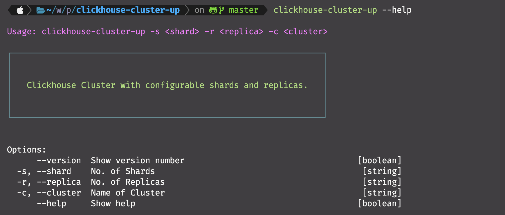

# clickhouse-cluster-up
<p align="center">
  
</p>

<p align="center">
    
    
    
    
    
</p>
<br>
<p align="left">
    Simplify ClickHouse cluster management with automation scripts &amp; workflows. Deploy, configure, scale, and maintain clusters effortlessly for seamless data processing &amp; analytics. Unlock the full potential of your data pipeline.
</p>
<br>

## Requirements

1. Node.js
2. Docker

<br>

## Installation

1. Clone the repository and then navigate to it.
2. Run ```npm install``` to install the dependencies.
3. Run ```npm install -g .``` to install the CLI.
<br>

For Linux Users:

> :warning: **This might cause an error** which can be resolved easily by using ```sudo``` with the command, **however**, using ```sudo``` with ```npm``` is **not recommended** because it might cause permission issues later. So instead put the code below in your .bashrc file and then run the above command again.
```
npm set prefix ~/.npm
PATH="$HOME/.npm/bin:$PATH"
PATH="./node_modules/.bin:$PATH"
```
4. Now you are good to go and can use the CLI globally!

Type ```clickhouse-cluster-up``` or ```clickhouse-cluster-up --help``` to get started.
<br>

## License

MIT © ***clickhouse-cluster-up***